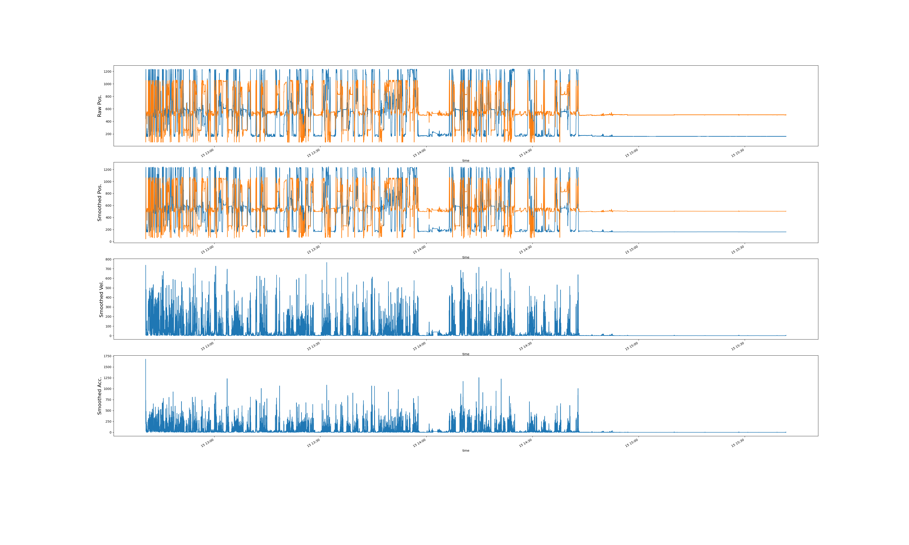
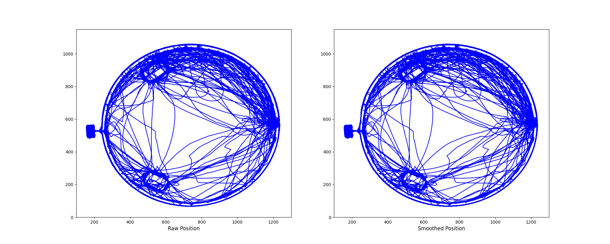
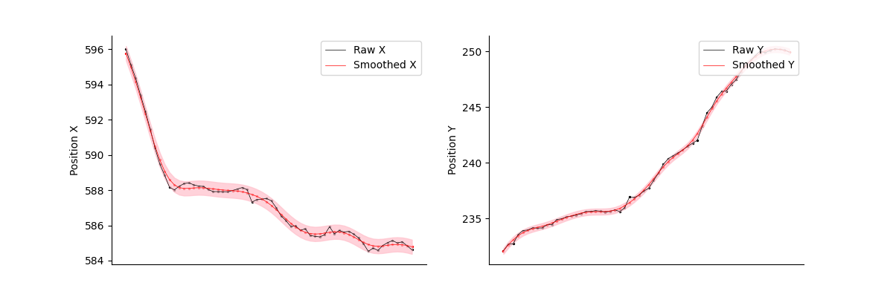
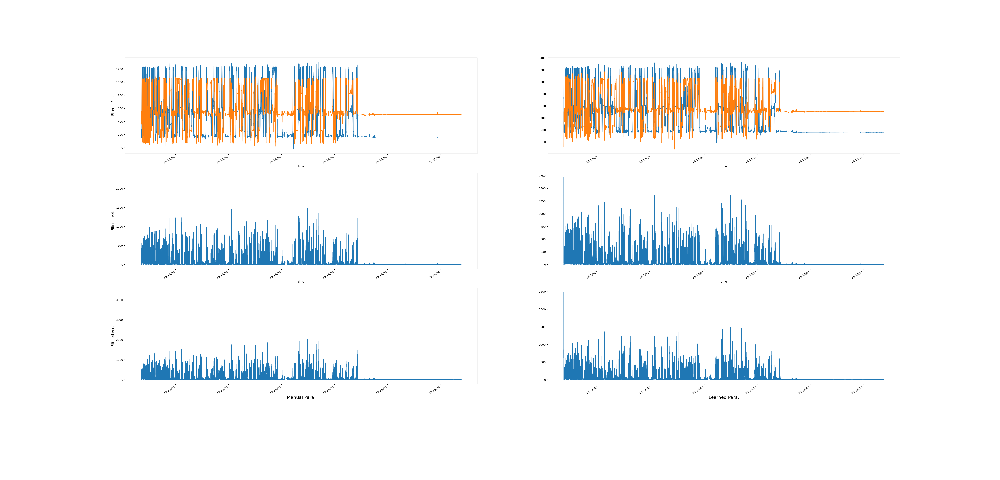
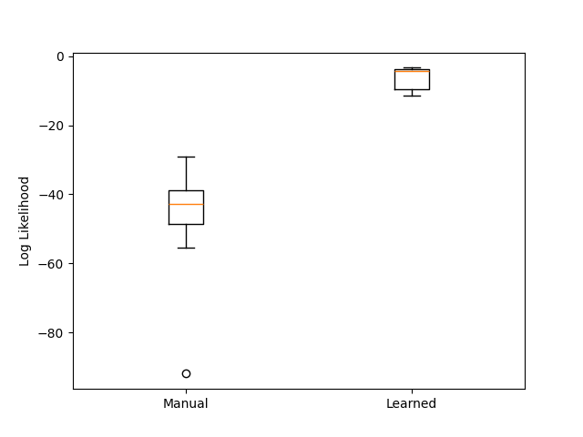
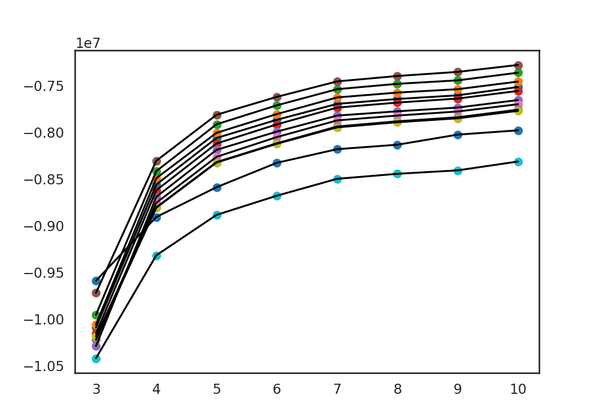
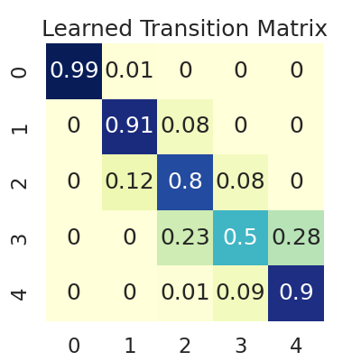
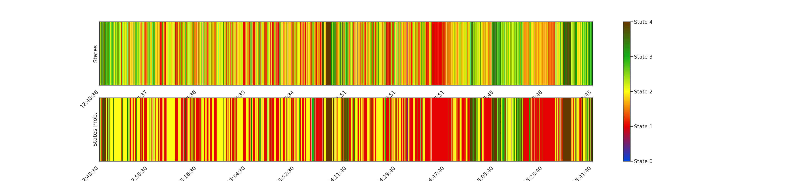
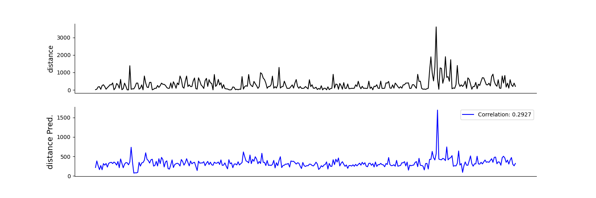

# Scripts for Data Analysis Involved in the Project
## Kinematics Data Processing
### Interpolate Missing Values in Raw Position Recordings
[Code](/Scripts/Kinematics_ProcessRawData.py) 

### Learn Parameters for Kalman Filter
Learn LDS parameters from the first 10 minutes of the mouse foraging data
[Code](/Scripts/Kinematics_Parameters.py) 

### Perform Kalman Filter
Use either manually set or learnt parameters. 
Apply filtering and smoothing functions to the data. 
[Code](/Scripts/Kinematics_LDS.py) 

### Display Smoothed Data
The raw position (x and y), smoothed position (x and y)
and smoothed speed and acceleration are displayed for each session. 
[Code](/Scripts/Kinematics_Display.py) 

 
*The raw and processed mouse kinematics data.*

 
*The raw and processed mouse position data.*

 
*A detailed example of the raw and processed (smoothed) mouse position data.*

### Compare Filtering for Manual/Learned Parameters
Compare the filtering results (positions, speed, acceleration)
of either manual or learned parameters. 
[Code](/Scripts/Kinematics_CompareParameters.py) 

 
*The processed mouse kinematics data of two types of parameters.*

 
*The log likelihood (per data point) of filtering, using manual or learned parameters.*

## HMM Models Based on Kinematics Data: Infer Mouse Behavioral States
### HMM Feature Processing
Get the kinematics data and weight of the mouse in each session. 
Compute whether mouse is in/out of the two patches based on position data. 
Compute the distance of mouse position to the arena center, determining whether it's running in the corridor or in the arena.
Each session outputs a dataframe with rows of time index
and columns of position/speed/acceleration/weight/patch etc. that is saved as a .parquet file. 
[Code](/Scripts/HMM_FeatureProcess.py) 

### HMM Model: Determine the Appropriate State Number
Determine the number of states to fit in the GLM-HMM model.
The features fit into the model is smoothed speed and acceleration.
Each short session is used to fit a GLM-HMM model with state number range from 3 to 10. Each model is then used to infer the states of the other short sessions that are concatenated into a complete test session. The loglikelihood of each inference is recorded.
[Code](/Scripts/HMM_FindSingleModel.py) 

 
*The summary of the model performances fitted from the 12 short sessions.*

### HMM Model Fitting
Use GLM-HMM model to infer the states of mouse during each session.
The model can be fit separately for each session or using a single session to fit a unified model used for all sessions.
The sequence of states are sorted from the lowest to highest speed. 
Each session outputs an array of states saved in a .npy file.
[Code for Seperated Model Fitting](/Scripts/HMM_FitModels.py)  
[Code for Unified Model Fitting](/Scripts/HMM_FitSingleModel.py) 

### Display Inferred HMM States
Select a short session as the unified model. Display the inferred states of each session by the unified model. The upper panel is the states in time resolution of
0.2 seconds, and the lower panel is the most-probable state in 10 seconds.
[Code](/Scripts/HMM_States.py) 

 
*The transition matrix of the unified model, fitted from short session 5.*

 
*The original and down-sampled states of mouse.*

### Display Transition Matrix over Time in Long Sessions
Display the change of transition matrices over time in long sessions. 
[Code](/Scripts/HMM_LongTransM.py) 

## Regression Models Based on Kinematics Data: Predict Foraging Bout Duration
### Regression Variables Processing
Process the possible dependent variables for predicting each time the distance the mouse moves the wheel or
the duration the mouse stays within the patch. 
Regressors include kinematics data, weight, pellets consumed
in the previous visit to the current/the other patch, time since the previous visit to either patch, etc. 
[Code](/Scripts/Regression_FeatureProcess.py) 

### Regression Model Fitting
Use different types of GLM to fit regression models. 
Models are cross-validated.

Average MSE per data point for Poisson Model Fitted: 3042894.9003117206
Average MSE per data point for Gaussian Model Fitted: 126148.73622145888    
Average MSE per data point for Gamma Model Fitted: 3760086.3396544424  
[Code](/Scripts/Regression_FitModels.py) 

 
*The original and predicted wheel moving distance during each visit of all short sessions, fit by GLM-Poisson model.*

 
*The original and predicted wheel moving distance during each visit of all short sessions, fit by GLM-Gaussian model.*
