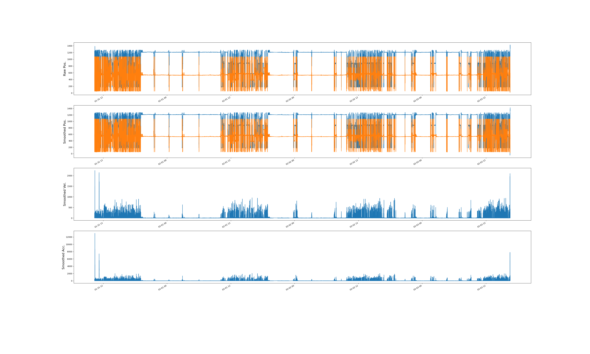
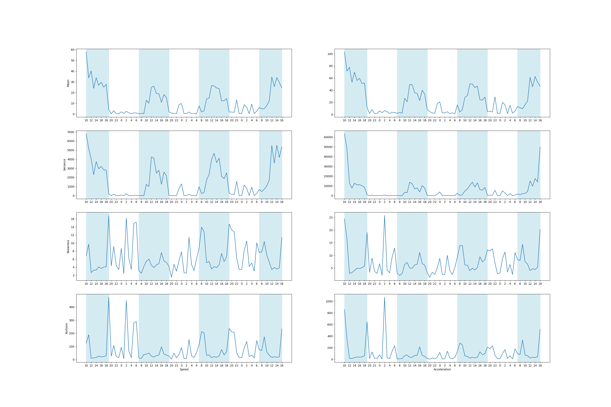
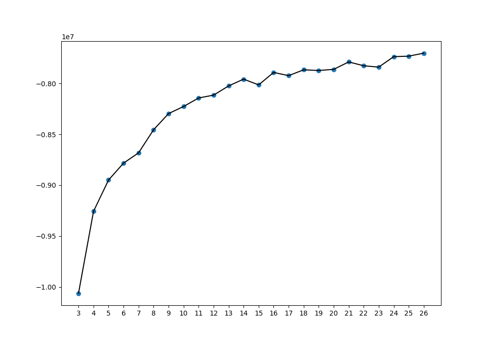
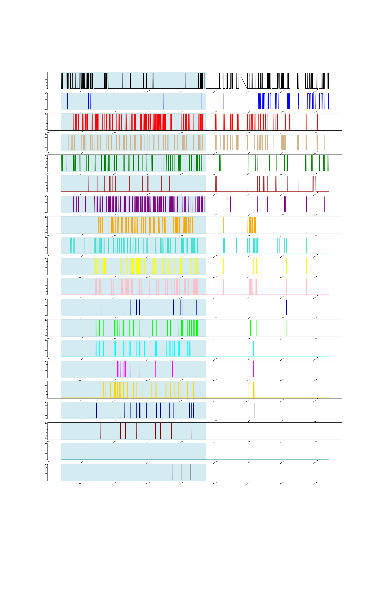
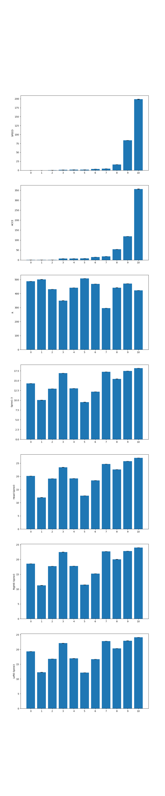
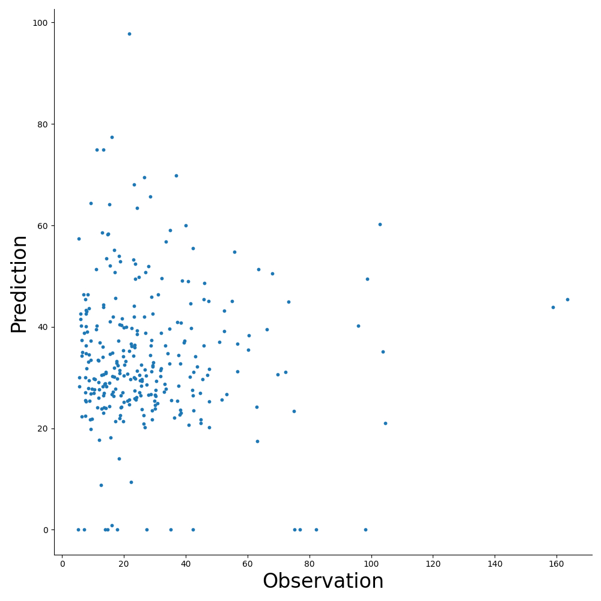

# **Explanation of Data Analysis Involved in the Project**

## **1. Introduction to the Arena**
Environment setup see [Sainsbury Wellcome Center - ProjectAeon](https://github.com/SainsburyWellcomeCentre/aeon_blog/tree/main).

### **i. Experiment:**  
Single mouse freely moving in the arena before or after social experiments. Each experiment typically lasts for 2 to 3 days. 
### **ii. Arena:**    
A circular arena with nest on the right hand side of the frame. Three patches in the inner arena for pellet delivery. Mouse can enter the inner arena through the gate via the corridor.  
  
### **iii. Patch:**  
Each patch contain a movable wheel that delivers pellets when the moving distance reaches a certain threshold.  

#### ***Each visit to a patch:*** 
Each visit start by detecting wheel movement. When the mouse stops moving the wheel and move away from the wheel for a certain distance,
the visit is marked as 'end'.

#### ***Pellet delivery:***

## **2. Kinematics Data Processing**
Use a Gaussian Linear Dynamical System (LDS) model and the Kalman filter algorithm to infer mouse kinematics (position, velocity, and acceleration) from noisy position measurements.  

### **i. Extract Body Centroid:**
The 'spine2' node label is treated as the centroid of the body (x and y positions)  
### **ii. Interpolate Missing Values in Raw Position Recordings**

### **iii. Learn Parameters for Kalman Filter**
Learn LDS parameters using data between 10-11 am during the first full day of mouse in the arena.  

$x_t = Ax_{t-1} + w_t$  with  $w_t \sim N(0,Q)$  and  $x_0 \sim N(m_0, V_0)$  
- $x_t = [\xi_1[t], \dot{\xi_1}[t], \ddot{\xi_1}[t], \xi_2[t], \dot{\xi_2}[t], \ddot{\xi_2}[t]]^T$ and $\xi[t], \dot{\xi}[t], \ddot{\xi}[t]$ are random variables representing the position, velocity and acceleration of the x and y positions of the mouse at sample time $t$  

- $A = 
\begin{bmatrix}
1 & T & T^2 & 0 & 0 & 0\\
0 & 1 & T & 0 & 0 & 0 \\
0 & 0 & 1 & 0 & 0 & 0 \\
0 & 0 & 0 & 1 & T & T^2 \\
0 & 0 & 0 & 0 & 1 & T \\
0 & 0 & 0 & 0 & 0 & 1 
\end{bmatrix}$  
    - $T$ is the sample period (0.1 s in this dataset)  

- $Q = \sigma_a^2 
\begin{bmatrix}
\frac{1}{4}T^4 & \frac{1}{2}T^3 & \frac{1}{2}T^2 & 0 & 0 & 0\\
\frac{1}{2}T^3 & T^2 & T & 0 & 0 & 0\\
\frac{1}{2}T^2 & T & 1 & 0 & 0 & 0 \\
0 & 0 & 0 & \frac{1}{4}T^4 & \frac{1}{2}T^3 & \frac{1}{2}T^2 \\
0 & 0 & 0 & \frac{1}{2}T^3 & T^2 & T \\
0 & 0 & 0 & \frac{1}{2}T^2 & T & 1
\end{bmatrix}$  

- $m_0 = 
[\xi_1[0], 0, 0, \xi_2[0], 0, 0]^T$  

- $V_0 = 
\begin{bmatrix}
10^{-6} & 0 & 0 & 0 & 0 & 0\\
0 & 10^{-6} & 0 & 0 & 0 & 0 \\
0 & 0 & 10^{-6} & 0 & 0 & 0 \\
0 & 0 & 0 & 10^{-6} & 0 & 0 \\
0 & 0 & 0 & 0 & 10^{-6} & 0 \\
0 & 0 & 0 & 0 & 0 & 10^{-6} 
\end{bmatrix}$  

$z_t = Cx_t + v_t$  with  $v_t \sim N(0,R)$  

- $C = 
\begin{bmatrix} 
1 & 0 & 0 & 0 & 0 & 0 \\
0 & 0 & 0 & 0 & 0 & 1
\end{bmatrix}$  

- $R = 
\begin{bmatrix} 
\sigma_x^2 & 0  \\
0 & \sigma_y^2
\end{bmatrix}$  

The learnt parameters for Pre-social BAA-1104048 mouse are:  
$\sigma_a =  25.05, \quad \sigma_x=-1.09, \quad \sigma_y=1.13$  

### **iv. Perform Kalman Filter**
Use learnt parameters to apply filtering and smoothing functions to the data. 

### **v. Display Kinematics**
#### ***Result:*** 

#### ***Properties of Speed and Acceleration during Experiment:*** 

## **3. Behavioral States Inference: Hidden Markov Model (HMM)** 
### **i. HMM Feature Processing**
#### ***Kinematics:*** 
Speed and acceleration.
#### ***Body Information:***
Distance between two body nodes: head and spine3, spine1 and spine3, left ear and spine3, right ear and spine3.

### **ii. Select the Appropriate State Number**
Determine the number of states to fit in the GLM-HMM model.
For each experiment, the HMM is inferred using the data during the first full day. This model is then used to fit states of the next full day
to calculate and record the corresponding likelihood.

### **iii. HMM Model Fitting**
Use a 20-state GLM-HMM model to infer the states of mouse during each session.
Models are fit separately for each session.
The sequence of states are sorted from the lowest to highest speed parameters.
 

### **iv. Features of Each State**
#### ***Parameters:***
 
#### ***Mouse Position in Each State:*** 
 

### **v. Behavioral Modules Characterized by States**
See [Start Visit](../Results/StartVisit.md) for predictions of starting visit of other mice.  
See [End Visit](../Results/EndVisit.md) for predictions of ending visit of other mice.  
See [Enter Arena](../Results/EnterArena.md) for predictions of entering arena of other mice.  
#### ***States: Start Forage in Patches***
 
 #### ***Probability: Start Forage in Patches***
 
  #### ***Prediction: Start Forage in Patches***
 

## **4. Foraging Bout Duration Prediction: Regression Models and Multi-Layer Perceptron**
### **i. Regression Variables Processing**
Process the possible dependent variables to predict the duration of the visit patch and forage. 
- speed: average speed during the 10 seconds period prior starting the visit.  
- acceleration: average acceleration during the 10 seconds period prior starting the visit.  
- last_pellets_self: the number of pellets consumed during the previous visit to this patch.  
- last_pellets_other: the number of pellets consumed during the previous visit to other patches.
- last_duration: the duration of the previous visit
- last_interval: the duration of interval between the end of the previous visit and the start of the current visit.
- last_pellets_interval: the duration of interval between the end of the previous visit during which pellets are being consumed and the start of the current visit.  
- entry: the duration of interval between the most recent entry to the inner arena through the gate and the start of the current visit.  

### **i. Linear Regression**
See [Linear Regression](../Results/LinearRegression.md) for results of other mice.
#### ***Result:***
 
#### ***Model:***
 

### **ii. Multi-Layer Perceptron**

